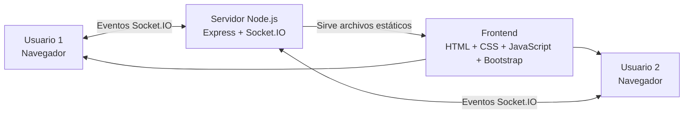
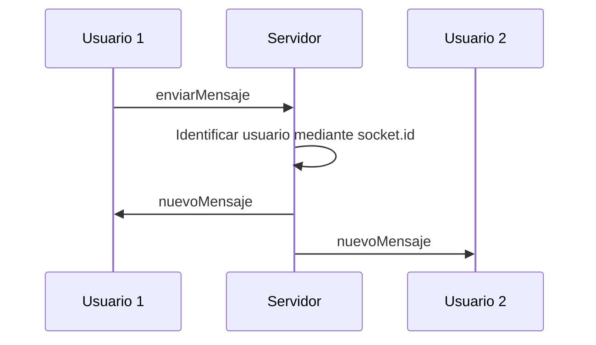

# Chat en tiempo real con WebSocket

Proyecto desarrollado como Trabajo Práctico de Práctica Profesional III.

La aplicación consiste en un chat en tiempo real que permite la comunicación entre varios usuarios mediante Socket.IO.

Cada usuario debe ingresar un nombre antes de acceder al chat y es identificado internamente mediante un `socket.id` único, permitiendo diferenciar incluso usuarios que utilicen el mismo nombre.

---

# Tecnologías utilizadas

El proyecto utiliza las siguientes tecnologías:

- **Node.js:** entorno de ejecución utilizado para el backend.
- **Express:** servidor web utilizado para servir los archivos del frontend.
- **HTTP:** módulo nativo de Node.js utilizado para crear el servidor sobre el cual funciona Socket.IO.
- **Socket.IO:** comunicación en tiempo real entre frontend y backend.
- **JavaScript:** utilizado tanto en el frontend como en el backend.
- **HTML5:** estructura de la interfaz.
- **CSS3:** estilos personalizados del chat.
- **Bootstrap 5:** diseño responsive y componentes visuales.
- **pnpm:** gestor de paquetes utilizado para instalar las dependencias.
- **Git:** control de versiones local del proyecto.

---

# Funcionalidades

El chat permite:

- Elegir un nombre de usuario antes de ingresar.
- Identificar cada conexión mediante un `socket.id` único.
- Permitir usuarios con el mismo nombre.
- Mostrar el usuario actual.
- Mostrar una lista de usuarios conectados.
- Mostrar la cantidad total de usuarios conectados.
- Enviar y recibir mensajes en tiempo real.
- Mostrar el nombre del usuario que envió cada mensaje.
- Mostrar la hora de los mensajes.
- Informar cuando un usuario ingresa al chat.
- Informar cuando un usuario abandona el chat.
- Mostrar la hora de los eventos de conexión y desconexión.
- Registrar desde el servidor el motivo de desconexión.
- Registrar en consola usuario, ID, fecha, hora y motivo de desconexión.
- Mostrar visualmente el estado de conexión con el servidor.
- Diferenciar visualmente los mensajes propios de los mensajes enviados por otros usuarios.
- Utilizar una interfaz oscura y responsive.

---

# Estructura del proyecto

```text
chat-tiempo-real/
│
├── public/
│   ├── index.html
│   ├── style.css
│   └── script.js
│
├── capturas/
│   ├── 01-pantalla-inicial.png
│   ├── 02-chat-funcionando.png
│   ├── 03-dos-usuarios-conectados.png
│   ├── 04-mensajes-enviados.png
│   ├── 05-ingreso-usuario.png
│   └── 06-desconexion-usuario.png
│
├── server.js
├── package.json
├── pnpm-lock.yaml
├── README.md
└── .gitignore
```

## Archivos principales

### `server.js`

Contiene el backend de la aplicación.

Se encarga de:

- Crear el servidor Express.
- Crear el servidor HTTP.
- Inicializar Socket.IO.
- Registrar usuarios.
- Asignar y utilizar el `socket.id`.
- Mantener la lista de usuarios conectados.
- Recibir mensajes.
- Distribuir mensajes a todos los clientes.
- Detectar conexiones y desconexiones.
- Registrar fecha, hora y motivo de desconexión.

### `public/index.html`

Contiene la estructura visual de la aplicación.

Incluye:

- Pantalla de ingreso.
- Formulario de nombre de usuario.
- Área principal del chat.
- Lista de usuarios conectados.
- Área de mensajes.
- Formulario para enviar mensajes.
- Indicador de conexión.
- Contador de usuarios.

### `public/script.js`

Contiene la lógica JavaScript ejecutada en el navegador.

Se encarga de:

- Conectarse con Socket.IO.
- Enviar el nombre del usuario.
- Enviar mensajes.
- Recibir mensajes.
- Actualizar la lista de usuarios.
- Mostrar eventos de ingreso.
- Mostrar eventos de salida.
- Actualizar el estado de conexión.
- Modificar dinámicamente la interfaz.

### `public/style.css`

Contiene los estilos propios de la aplicación.

Se utiliza un diseño oscuro y minimalista para reducir el brillo de la interfaz y facilitar su utilización.

### `capturas/`

Contiene las evidencias visuales utilizadas dentro de este README.

---

# Requisitos

Para ejecutar el proyecto es necesario tener instalado:

- Node.js.
- pnpm.
- Un navegador web moderno.

Para comprobar las versiones instaladas se pueden ejecutar los siguientes comandos:

```bash
node --version
```

```bash
pnpm --version
```

---

# Instalación

Una vez descargado o copiado el proyecto, ingresar mediante una terminal a la carpeta del proyecto:

```bash
cd chat-tiempo-real
```

Instalar las dependencias:

```bash
pnpm install
```

Este comando lee el archivo `package.json` e instala las dependencias necesarias dentro de la carpeta `node_modules`.

Las principales dependencias utilizadas son:

```text
express
socket.io
```

También se utiliza `nodemon` como dependencia de desarrollo.

---

# Ejecución

## Ejecución normal

Para iniciar el servidor:

```bash
pnpm start
```

El servidor quedará disponible en:

```text
http://localhost:3000
```

Luego se debe abrir esa dirección desde un navegador.

## Ejecución durante el desarrollo

También se puede ejecutar:

```bash
pnpm dev
```

Este comando utiliza `nodemon`, que reinicia automáticamente el servidor cuando se detectan modificaciones en `server.js`.

---

# Funcionamiento general

Cuando una persona abre la aplicación, primero aparece una pantalla donde debe ingresar un nombre de usuario.

Una vez enviado el nombre:

1. El frontend envía el nombre al servidor.
2. El servidor obtiene el `socket.id` de la conexión.
3. Se crea un usuario con su nombre e identificador.
4. El usuario se almacena temporalmente en memoria.
5. El servidor confirma el registro.
6. El frontend muestra la pantalla principal del chat.
7. Todos los usuarios reciben la lista actualizada de personas conectadas.

Cada usuario queda identificado mediante:

```text
Nombre + socket.id
```

Por ejemplo:

```text
Franco - aB93kd...
Franco - K82jd1...
```

Aunque los dos usuarios tengan el mismo nombre, sus conexiones siguen siendo diferentes debido al `socket.id`.

---

# Comunicación mediante WebSocket / Socket.IO

La comunicación entre el navegador y el servidor se realiza utilizando eventos de Socket.IO.

El frontend y el backend pueden enviar y escuchar eventos sin necesidad de recargar la página.

## `socket.emit()`

Se utiliza para emitir un evento.

Por ejemplo, desde el cliente:

```javascript
socket.emit("enviarMensaje", texto);
```

El cliente envía el evento `enviarMensaje` al servidor.

## `socket.on()`

Se utiliza para escuchar un evento.

Por ejemplo, en el servidor:

```javascript
socket.on("enviarMensaje", (texto) => {
    // Procesamiento del mensaje
});
```

## `io.emit()`

Desde el servidor permite enviar un evento a todos los usuarios conectados.

Por ejemplo:

```javascript
io.emit("nuevoMensaje", datosMensaje);
```

De esta manera todos los navegadores reciben el nuevo mensaje.

---

# Eventos utilizados

| Evento | Dirección | Función |
|---|---|---|
| `connection` | Socket.IO → Servidor | Detecta una nueva conexión |
| `registrarUsuario` | Cliente → Servidor | Envía el nombre elegido |
| `usuarioRegistrado` | Servidor → Cliente | Confirma el registro del usuario |
| `actualizarUsuarios` | Servidor → Clientes | Actualiza la lista de conectados |
| `usuarioIngreso` | Servidor → Clientes | Informa el ingreso de un usuario |
| `enviarMensaje` | Cliente → Servidor | Envía un mensaje |
| `nuevoMensaje` | Servidor → Clientes | Distribuye el mensaje |
| `usuarioSalida` | Servidor → Clientes | Informa la salida de un usuario |
| `disconnect` | Socket.IO | Detecta una desconexión |
| `connect` | Socket.IO → Cliente | Indica que existe conexión con el servidor |

---

# Envío de mensajes

Cuando un usuario escribe un mensaje y presiona **Enviar**, el frontend ejecuta:

```javascript
socket.emit("enviarMensaje", texto);
```

El servidor recibe el mensaje:

```javascript
socket.on("enviarMensaje", (texto) => {
```

Luego utiliza el `socket.id` para identificar qué usuario realizó el envío.

Finalmente distribuye el mensaje:

```javascript
io.emit("nuevoMensaje", datosMensaje);
```

El mensaje enviado contiene:

```text
ID del usuario
Nombre
Mensaje
Fecha
Hora
```

---

# Identificación de usuarios

Socket.IO genera automáticamente un identificador único para cada conexión:

```javascript
socket.id
```

Este ID permite distinguir conexiones aunque los usuarios tengan el mismo nombre.

Los usuarios conectados se almacenan en el servidor utilizando un `Map`.

Ejemplo conceptual:

```text
socket.id          usuario

A72jd82     →      Franco
P83ks91     →      Pedro
K92js10     →      Franco
```

En este ejemplo existen dos usuarios llamados Franco, pero ambos poseen IDs distintos.

---

# Desconexión de usuarios

Socket.IO permite detectar una desconexión mediante:

```javascript
socket.on("disconnect", (reason) => {
```

El parámetro `reason` contiene el motivo detectado por Socket.IO.

Cuando un usuario se desconecta, el servidor registra en consola:

```text
Fecha
Hora
Nombre del usuario
socket.id
Motivo de desconexión
```

Ejemplo:

```text
[28/08/2026 22:15:32] Usuario: Pedro | ID: AbC123 | Motivo: transport close
```

Luego el usuario es eliminado de la lista de conectados y los demás clientes reciben el evento `usuarioSalida`.

---

# Diagrama de arquitectura



## Flujo de un mensaje



---

# Capturas de pantalla

## Pantalla inicial

Pantalla donde el usuario ingresa su nombre antes de acceder al chat.


---

## Chat funcionando

Vista general de la aplicación funcionando.


---

## Dos usuarios conectados

Prueba realizada con dos navegadores conectados al mismo servidor.


---

## Mensajes enviados

Intercambio de mensajes en tiempo real entre usuarios.


---

## Ingreso de un usuario

Evento generado cuando un nuevo usuario entra al chat.


---

## Desconexión de un usuario

Evento mostrado cuando uno de los usuarios abandona el chat.


---

# Pruebas realizadas

Durante el desarrollo se realizaron diferentes pruebas de funcionamiento.

| Prueba | Resultado |
|---|---|
| Ingresar un nombre de usuario | Correcto |
| Intentar ingresar sin nombre | Bloqueado |
| Conectar dos usuarios | Correcto |
| Utilizar dos usuarios con el mismo nombre | Correcto |
| Verificar IDs diferentes | Correcto |
| Enviar mensajes entre dos usuarios | Correcto |
| Mostrar hora de los mensajes | Correcto |
| Mostrar ingreso de usuario | Correcto |
| Mostrar salida de usuario | Correcto |
| Cerrar una pestaña | Desconexión detectada |
| Cerrar el navegador | Desconexión detectada |
| Recargar la página | La conexión anterior se desconecta |
| Interrumpir la conexión | Socket.IO detecta la pérdida de conexión |
| Actualizar lista de usuarios | Correcto |
| Verificar motivo de desconexión en servidor | Correcto |

---

# Problemas conocidos

Actualmente los usuarios se almacenan únicamente en memoria mediante un `Map`.

Por este motivo, si el servidor se reinicia, la información de los usuarios conectados se pierde.

También, al recargar completamente la página, el usuario debe volver a ingresar su nombre.

El proyecto actualmente no mantiene historial permanente de mensajes.

---

# Mejoras futuras

Como posibles mejoras se podrían implementar:

- Persistencia de usuarios.
- Historial de mensajes.
- Base de datos.
- Recuperación automática de sesión.
- Salas privadas.
- Mensajes privados.
- Autenticación mediante usuario y contraseña.
- Avatares.
- Indicador de usuario escribiendo.
- Fecha completa visible en los mensajes.
- Notificaciones.
- Mejor manejo de reconexiones.
- Panel de administración.

---

# Control de versiones con Git

El proyecto fue desarrollado utilizando Git como sistema de control de versiones local.

Durante el desarrollo se realizaron distintos commits para representar la evolución del proyecto.

## Commits

> Los IDs de esta tabla deben reemplazarse por los IDs reales obtenidos mediante `git log --oneline`.

| Commit | Cambios realizados |
|---|---|
| `ID-COMMIT-01` | Creación de la estructura inicial y configuración del servidor |
| `ID-COMMIT-02` | Creación de la interfaz inicial del chat |
| `ID-COMMIT-03` | Registro de usuarios y eventos de conexión y desconexión |
| `ID-COMMIT-04` | Implementación de mensajes en tiempo real |
| `ID-COMMIT-05` | Mejora de interfaz y estado de conexión |
| `ID-COMMIT-06` | Aplicación de tema oscuro minimalista |

Para consultar el historial:

```bash
git log --oneline
```

---

# Tags

Se utilizarán tags de Git para identificar versiones importantes del desarrollo.

| Tag | Descripción |
|---|---|
| `v0.1.0` | Estructura e interfaz inicial |
| `v0.5.0` | Chat funcional con usuarios y mensajes |
| `v1.0.0` | Versión final del chat |

Los tags se mantienen únicamente en el repositorio Git local.

---

# Autor

**Franco Carrasco**

Práctica Profesional III  
2026

---

# Conclusión

El proyecto permitió implementar un sistema de comunicación en tiempo real utilizando Node.js y Socket.IO.

A través del uso de eventos se logró establecer comunicación bidireccional entre el frontend y el backend, permitiendo registrar usuarios, mantener una lista de conexiones activas, enviar mensajes y detectar desconexiones.

El uso de `socket.id` permite identificar de manera única cada conexión, mientras que Git permite mantener documentada la evolución del desarrollo.

El proyecto puede ser instalado y ejecutado por otra persona utilizando las instrucciones incluidas en este README.