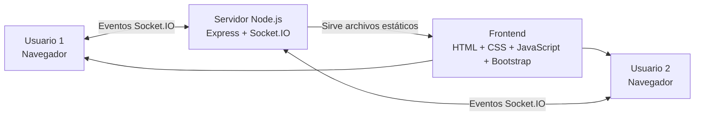
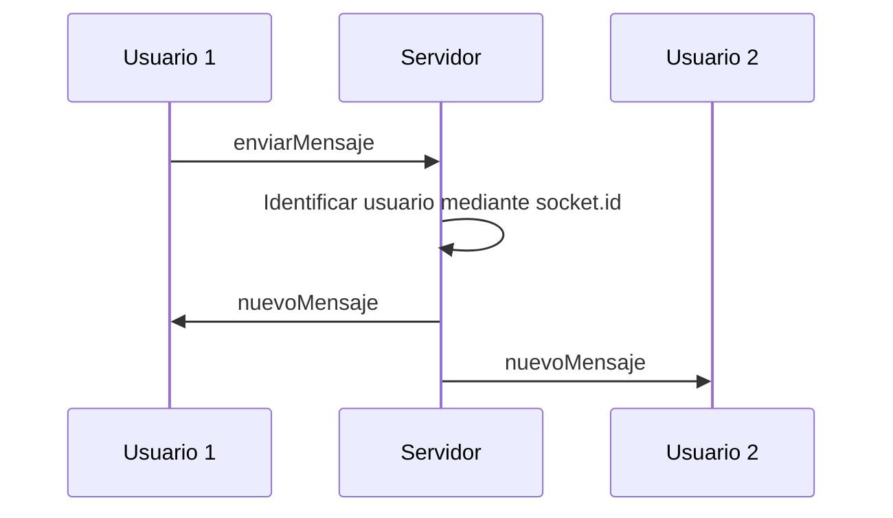
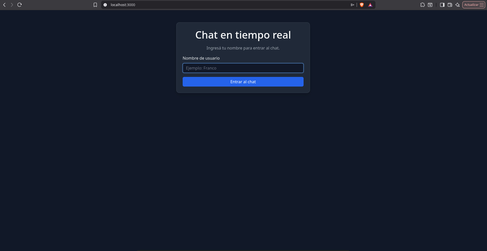
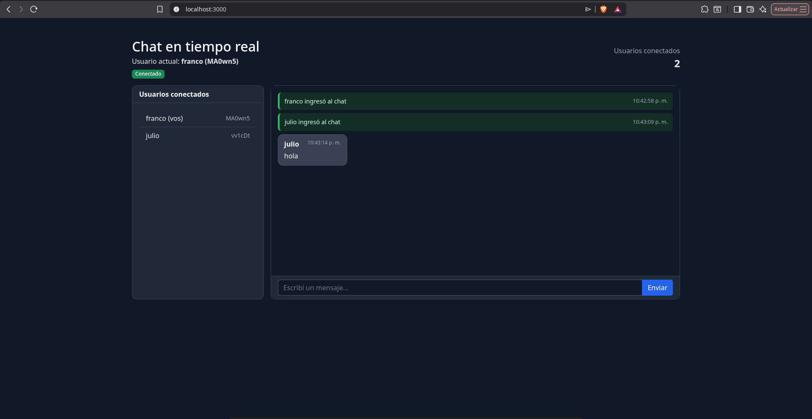

# Chat en tiempo real con WebSocket

Trabajo Práctico desarrollado para la materia **Práctica Profesional III**.

El proyecto consiste en un chat en tiempo real desarrollado con Node.js y Socket.IO, donde varios usuarios pueden conectarse simultáneamente, intercambiar mensajes y visualizar eventos de ingreso y desconexión.

Cada conexión es identificada mediante un `socket.id` único, por lo que pueden existir usuarios con el mismo nombre sin que se produzcan conflictos.

---

# Tecnologías utilizadas

- **Node.js:** entorno de ejecución utilizado para desarrollar el backend.
- **Express:** framework utilizado para crear el servidor web y servir el frontend.
- **HTTP:** módulo nativo de Node.js utilizado para crear el servidor sobre el cual funciona Socket.IO.
- **Socket.IO:** comunicación en tiempo real entre los navegadores y el servidor.
- **JavaScript:** utilizado tanto en frontend como backend.
- **HTML5:** estructura de la interfaz.
- **CSS3:** estilos personalizados.
- **Bootstrap 5:** diseño responsive y componentes visuales.
- **pnpm:** gestor de paquetes utilizado para administrar las dependencias.
- **Git:** sistema de control de versiones utilizado de manera local.

---

# Funcionalidades

La aplicación permite:

- Elegir un nombre antes de ingresar al chat.
- Identificar cada usuario mediante un `socket.id` único.
- Permitir usuarios con el mismo nombre.
- Mostrar el usuario actual.
- Mostrar los usuarios conectados.
- Mostrar la cantidad de usuarios conectados.
- Enviar mensajes en tiempo real.
- Recibir mensajes sin recargar la página.
- Mostrar quién envió cada mensaje.
- Mostrar la hora de cada mensaje.
- Informar cuándo un usuario ingresa.
- Informar cuándo un usuario abandona el chat.
- Mostrar la hora de los eventos de ingreso y salida.
- Detectar desconexiones desde el servidor.
- Registrar usuario, ID, fecha, hora y motivo de desconexión.
- Mostrar el estado de conexión con el servidor.
- Diferenciar visualmente mensajes propios y mensajes de otros usuarios.
- Utilizar una interfaz oscura y responsive.

---

# Estructura del proyecto

```text
chat-tiempo-real/
│
├── public/
│   ├── index.html
│   ├── style.css
│   └── script.js
│
├── capturas/
│   ├── 01-pantalla-inicial.jpg
│   ├── 02-chat-funcionando.jpg
│   ├── 03-dos-usuarios-conectados.jpg
│   ├── 04-mensajes-enviados.jpg
│   ├── 05-ingreso-usuario.jpg
│   ├── 06-desconexion-usuario.jpg
│   ├── 07-motivo-desconexion-servidor.jpg
│   └── 08-readme-stackedit.jpg
│
├── server.js
├── package.json
├── pnpm-lock.yaml
├── README.md
└── .gitignore
```

---

# Archivos principales

## server.js

Contiene el backend de la aplicación.

Sus principales funciones son:

- Crear el servidor Express.
- Crear el servidor HTTP.
- Inicializar Socket.IO.
- Detectar nuevas conexiones.
- Registrar usuarios.
- Asociar cada usuario con su `socket.id`.
- Mantener la lista de usuarios conectados.
- Recibir mensajes.
- Enviar mensajes a todos los clientes.
- Detectar desconexiones.
- Registrar el motivo de desconexión.
- Obtener fecha y hora de los eventos.

---

## public/index.html

Contiene la estructura visual de la aplicación.

Incluye:

- Pantalla de ingreso.
- Campo para escribir el nombre.
- Pantalla principal del chat.
- Usuario actual.
- Estado de conexión.
- Cantidad de usuarios conectados.
- Lista de usuarios.
- Área de mensajes.
- Formulario para enviar mensajes.

---

## public/script.js

Contiene la lógica JavaScript ejecutada desde el navegador.

Se encarga de:

- Conectarse al servidor mediante Socket.IO.
- Registrar al usuario.
- Enviar mensajes.
- Recibir mensajes.
- Mostrar usuarios conectados.
- Mostrar eventos de ingreso.
- Mostrar eventos de desconexión.
- Actualizar el contador de usuarios.
- Mostrar el estado de conexión.
- Modificar dinámicamente los elementos HTML.

---

## public/style.css

Contiene los estilos propios del proyecto.

Se implementó una interfaz oscura y minimalista para reducir el brillo de la pantalla y facilitar la lectura.

También permite diferenciar visualmente:

- Mensajes propios.
- Mensajes de otros usuarios.
- Eventos de ingreso.
- Eventos de desconexión.
- Estado de conexión.

---

# Requisitos

Para ejecutar el proyecto es necesario tener instalado:

- Node.js.
- pnpm.
- Un navegador web moderno.

Se pueden comprobar las versiones instaladas mediante:

```bash
node --version
```

```bash
pnpm --version
```

---

# Instalación

Primero se debe ingresar a la carpeta del proyecto:

```bash
cd chat-tiempo-real
```

Luego instalar las dependencias:

```bash
pnpm install
```

El comando lee el archivo `package.json` e instala las dependencias necesarias dentro de `node_modules`.

Las principales dependencias utilizadas son:

```text
express
socket.io
```

También se utiliza `nodemon` como dependencia de desarrollo.

---

# Ejecución

## Ejecución normal

Para iniciar el servidor:

```bash
pnpm start
```

Una vez iniciado, la aplicación queda disponible en:

```text
http://localhost:3000
```

---

## Ejecución durante el desarrollo

Para trabajar utilizando Nodemon:

```bash
pnpm dev
```

Nodemon reinicia automáticamente el servidor cuando se detectan cambios en `server.js`.

---

# Funcionamiento general

Cuando una persona accede a la aplicación se muestra inicialmente una pantalla para ingresar un nombre.

Una vez ingresado:

1. El frontend envía el nombre al servidor.
2. Socket.IO identifica la conexión mediante `socket.id`.
3. El servidor crea un objeto con el nombre y el ID.
4. El usuario es almacenado temporalmente en un `Map`.
5. El servidor confirma el registro.
6. El navegador muestra la pantalla principal.
7. El servidor envía la lista actualizada de usuarios.
8. Todos los clientes visualizan el ingreso del nuevo usuario.

Cada usuario queda identificado por:

```text
Nombre + socket.id
```

Por ejemplo:

```text
Franco - MA0wn5...
Franco - BSA7CL...
```

Aunque ambos usuarios tengan el mismo nombre, sus conexiones son diferentes porque poseen distintos identificadores.

---

# Comunicación mediante WebSocket / Socket.IO

La comunicación entre el frontend y el backend se realiza mediante eventos de Socket.IO.

Esto permite intercambiar información entre el navegador y el servidor sin recargar la página.

---

## socket.emit()

`socket.emit()` permite emitir un evento.

Por ejemplo, el navegador envía un mensaje al servidor mediante:

```javascript
socket.emit("enviarMensaje", texto);
```

---

## socket.on()

`socket.on()` permite escuchar un evento.

El servidor recibe el mensaje mediante:

```javascript
socket.on("enviarMensaje", (texto) => {
    // Procesamiento del mensaje
});
```

---

## io.emit()

`io.emit()` permite que el servidor envíe un evento a todos los usuarios conectados.

Por ejemplo:

```javascript
io.emit("nuevoMensaje", datosMensaje);
```

De esta manera todos los navegadores reciben el mismo mensaje en tiempo real.

---

# Eventos utilizados

| Evento | Dirección | Función |
|---|---|---|
| `connection` | Socket.IO → Servidor | Detecta una nueva conexión |
| `registrarUsuario` | Cliente → Servidor | Envía el nombre elegido |
| `usuarioRegistrado` | Servidor → Cliente | Confirma el registro |
| `actualizarUsuarios` | Servidor → Clientes | Actualiza usuarios conectados |
| `usuarioIngreso` | Servidor → Clientes | Informa un nuevo ingreso |
| `enviarMensaje` | Cliente → Servidor | Envía un mensaje |
| `nuevoMensaje` | Servidor → Clientes | Distribuye un mensaje |
| `usuarioSalida` | Servidor → Clientes | Informa una desconexión |
| `disconnect` | Socket.IO | Detecta una desconexión |
| `connect` | Socket.IO → Cliente | Detecta la conexión con el servidor |

---

# Envío de mensajes

Cuando el usuario escribe un mensaje y presiona **Enviar**, el frontend ejecuta:

```javascript
socket.emit("enviarMensaje", texto);
```

El servidor recibe el evento:

```javascript
socket.on("enviarMensaje", (texto) => {
```

Luego identifica al usuario mediante:

```javascript
usuarios.get(socket.id);
```

Una vez identificado, crea la información del mensaje y la envía a todos los clientes mediante:

```javascript
io.emit("nuevoMensaje", datosMensaje);
```

Cada mensaje contiene:

```text
ID del usuario
Nombre
Texto
Fecha
Hora
```

---

# Identificación de usuarios

Socket.IO genera automáticamente un identificador único para cada conexión:

```javascript
socket.id
```

Los usuarios son almacenados en un `Map` utilizando el ID como clave.

Ejemplo:

```text
socket.id          usuario

MA0wn5...   →      Franco
vV1cDt...   →      Julio
BSA7CL...   →      Francisco
```

Esto permite identificar correctamente cada conexión aunque existan usuarios que utilicen el mismo nombre.

---

# Desconexión de usuarios

Socket.IO permite detectar cuándo una conexión termina mediante:

```javascript
socket.on("disconnect", (reason) => {
```

El parámetro `reason` contiene el motivo detectado por Socket.IO.

Cuando ocurre una desconexión, el servidor registra:

```text
Fecha
Hora
Usuario
socket.id
Motivo
```

Ejemplo:

```text
[28/08/2026 22:45:44] Usuario: Franco | ID: MA0wn5... | Motivo: transport close
```

Luego el usuario es eliminado de la lista de conectados y el servidor informa el evento a los demás clientes.

---

# Diagrama de arquitectura



---

# Flujo de un mensaje



---

# Capturas de pantalla

## Pantalla inicial

Pantalla mostrada antes de ingresar al chat.



---

## Chat funcionando

Vista general de la interfaz del chat funcionando.



---

## Dos usuarios conectados

Prueba realizada con dos usuarios conectados simultáneamente.


---

## Mensajes enviados

Prueba de intercambio de mensajes en tiempo real.


---

## Ingreso de un usuario

Evento generado cuando un nuevo usuario se conecta al chat.


---

## Desconexión de un usuario

Evento generado cuando uno de los usuarios abandona el chat.


---

## Motivo de desconexión desde el servidor

La terminal del servidor registra el usuario, identificador, fecha, hora y motivo de desconexión.


---

## README visualizado en StackEdit

El archivo README fue verificado utilizando StackEdit para comprobar su formato Markdown y los diagramas Mermaid.


---

# Pruebas realizadas

| Prueba | Resultado |
|---|---|
| Ingresar un nombre | Correcto |
| Intentar ingresar sin nombre | Bloqueado |
| Conectar dos usuarios | Correcto |
| Utilizar dos usuarios con el mismo nombre | Correcto |
| Verificar diferentes `socket.id` | Correcto |
| Enviar mensajes | Correcto |
| Recibir mensajes en tiempo real | Correcto |
| Mostrar hora de los mensajes | Correcto |
| Mostrar ingreso de usuario | Correcto |
| Mostrar salida de usuario | Correcto |
| Cerrar una pestaña | Desconexión detectada |
| Cerrar el navegador | Desconexión detectada |
| Recargar la página | Desconexión detectada |
| Interrumpir la conexión | Socket.IO detecta la pérdida |
| Actualizar usuarios conectados | Correcto |
| Mostrar cantidad de usuarios | Correcto |
| Registrar motivo de desconexión | Correcto |

---

# Problemas conocidos

Actualmente los usuarios conectados se almacenan solamente en memoria utilizando un `Map`.

Por este motivo, cuando el servidor se reinicia se pierde la información de las conexiones existentes.

Al recargar completamente la página, el usuario debe volver a ingresar su nombre.

Los mensajes tampoco se almacenan permanentemente, por lo que desaparecen cuando se recarga la página o se reinicia el servidor.

---

# Mejoras futuras

Como posibles mejoras futuras se podrían incorporar:

- Persistencia de usuarios.
- Base de datos.
- Historial de mensajes.
- Recuperación automática de sesión.
- Salas de chat.
- Mensajes privados.
- Autenticación.
- Avatares.
- Indicador de usuario escribiendo.
- Notificaciones.
- Mejor manejo de reconexiones.
- Panel de administración.

---

# Control de versiones con Git

El proyecto fue desarrollado utilizando Git como sistema de control de versiones local.

Los commits realizados durante el desarrollo permiten observar la evolución progresiva de la aplicación.

## Commits realizados

| Commit | Cambios realizados |
|---|---|
| `a8df482` | Creación de la estructura inicial y configuración del servidor |
| `bddc5f5` | Creación de la interfaz inicial del chat |
| `4103028` | Registro de usuarios y eventos de conexión y desconexión |
| `96cbd61` | Implementación de mensajes en tiempo real |
| `87963dd` | Aplicación de tema oscuro minimalista |

El historial puede consultarse mediante:

```bash
git log --oneline
```

---

# Tags

Se utilizaron tags para marcar versiones importantes del proyecto.

| Tag | Descripción |
|---|---|
| `v0.1.0` | Estructura e interfaz inicial |
| `v0.5.0` | Chat funcional con usuarios y mensajes |
| `v1.0.0` | Versión final del chat |

Los tags pueden visualizarse mediante:

```bash
git tag
```

---

# Autor

**Franco Carrasco**

Práctica Profesional III  
2026

---

# Conclusión

El proyecto permitió desarrollar un sistema de chat en tiempo real utilizando Node.js, Express y Socket.IO.

Mediante el uso de eventos se implementó una comunicación bidireccional entre frontend y backend, permitiendo registrar usuarios, mantener una lista de conexiones activas, enviar mensajes y detectar desconexiones.

El uso de `socket.id` permite identificar de manera única cada conexión, incluso cuando dos personas utilizan el mismo nombre.

Además, Git permitió registrar de forma progresiva la evolución del desarrollo mediante commits y tags.

El proyecto puede ser instalado y ejecutado por otra persona siguiendo las instrucciones incluidas en este README.